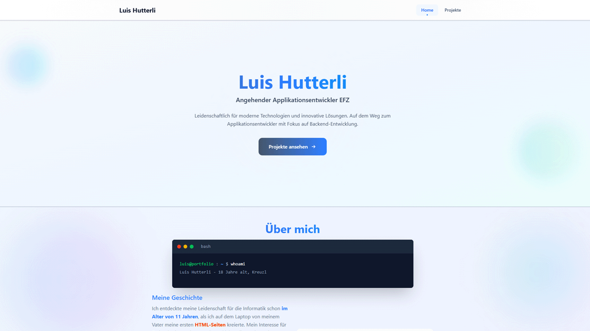

# Portfolio Website



Persönliches Portfolio gebaut mit [Astro](https://astro.build/)

## Features
- Moderne, schnelle statische Seite
- Projekte als Markdown Content Collections
- View Transitions & Client-Side Routing
- Optimiert für SEO & Performance

## Entwicklung

```sh
npm install
npm run dev
```

Live: [luishutterli.ch](https://luishutterli.ch)
